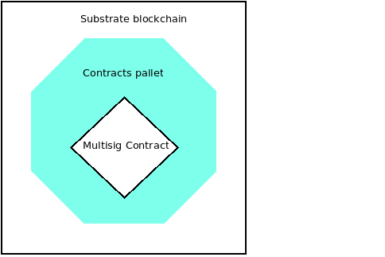
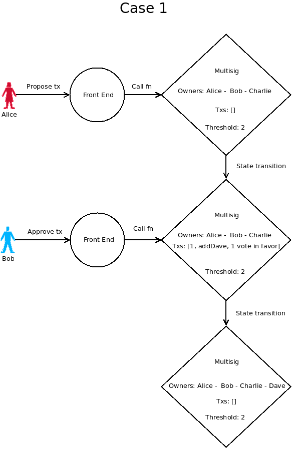
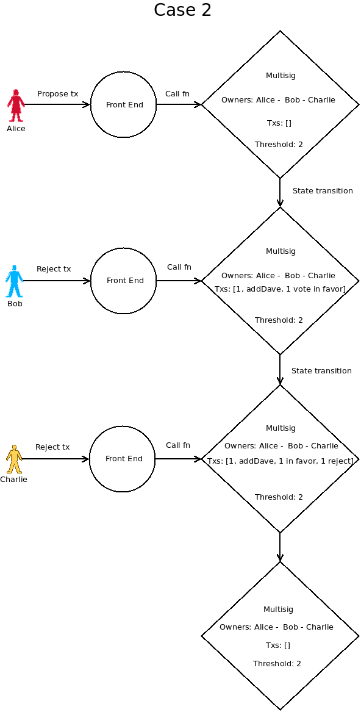
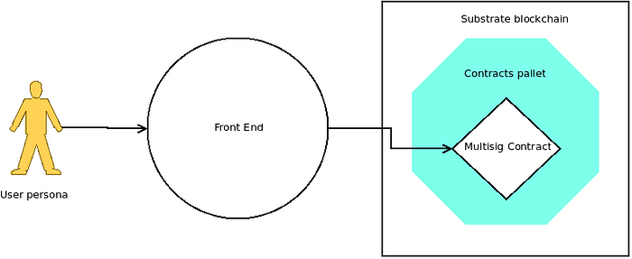

# Contract Pallet Multisig Implementation: Backendless Architecture Document

## Resume
This document outlines the architecture of a contract pallet multisig implementation without a backend. It provides a detailed view of the system’s structure, components, and interactions, focusing on the advantages and disadvantages of a backendless approach.

## System Architecture
The system architecture is primarily composed of the on-chain component.

## On-Chain Component
The on-chain component consists of the contract pallet and the multisig contract. The contract pallet is a module in the Substrate framework that allows us to write and deploy smart contracts on a blockchain. The multisig contract is a type of smart contract that requires multiple parties to
sign off on transactions.

In a backendless architecture, the on-chain contract is more complex. It needs to store all proposed transactions and have a logic for removing them. This increases the complexity and size of the on-chain contract.

Here’s an overview of its main data structures and functions:

## Data Structures
**Transaction** — Represents a transaction that can be performed when a threshold is met. It includes the receiver’s address, the function selector, the input data, the value to be transferred, the gas limit, and a flag that indicates whether re entry is allowed.

**MultiSig** — The main data structure of the contract. It includes the list of owners, the threshold needed to approve transactions, a list of transactions, and a list of approvals and rejections. It also includes a mapping of transactions and approvals for constant-time access.

## Constructors
**new** — Creates a new multi-signature wallet with a specified threshold and a list of owners.

**default** — Creates a default multi-signature wallet with the caller as the single owner and a threshold of 1.

## Functions
**propose_tx** — Proposes a new transaction. Only an owner can propose a transaction. It checks the maximum number of transactions hasn’t been reached, stores the transaction, and if the threshold is met (in cases where the threshold is 1), it executes the transaction.

**approve_tx** — Approves a transaction by an owner. If the threshold is met with this approval, the transaction is executed and then removed.

**reject_tx** — Rejects a transaction by an owner. If the threshold can’t be met with the remaining approvals, the transaction is deleted.

**try_execute_tx** — Execute a transaction if the threshold has been met and remove it from the storage. It’s called try because nothing is done if the condition is not met.
The external invocation of this function is permitted, although it is designed to be invoked automatically by the approve_tx. We have identified specific exceptional scenarios where manual invocation of this function is necessary.

**try_remove_tx** — Remove a transaction if the threshold cannot be met with the remaining approvals. It’s called try because the condition is checked too.
As mentioned in the description of try_execute_tx, this function is executed automatically. However, there are certain exceptional situations where manual invocation of this function becomes necessary.

**add_owner** — Adds an owner to the contract. The maximum number of owners is limited. It’s a self call function that can be called by the same contract passing the approval process.

**remove_owner** — Removes an owner from the contract. This is a self call function too change_threshold — Changes the threshold necessary for transactions to be approved. This is a self call function called only if approval process has been finalized

**transfer** — Transfers funds to a specified address. This is also a self call function.

In addition to these, there are a number of getter functions to read the state of the contract such as getting the list of owners, the threshold, transactions, approvals, and rejections that will be used by the front end application.

The contract uses events for logging operations like transaction proposal, approval, rejection, addition and removal of owners, threshold change, and transfer of funds. This makes the contract traceable from an event subscriber.

## Off-Chain Component
The off-chain component is a web application, primarily built using a technology stack that includes React, NextJS, and TypeScript.

React, a popular JavaScript library for building user interfaces, along with NextJS, a React framework for production-grade applications, are used to construct the frontend application. This application communicates with the on-chain component, submits transactions, and displays information to the user.

TypeScript, a statically typed superset of JavaScript, is used to ensure type safety and improve the development experience. It helps catch errors early in the development process and enhances code readability and maintainability.

Please note that this is the proposed technology stack and it may be supplemented with other libraries or tools as necessary to meet specific requirements or to enhance the functionality and performance of the off-chain component.

## Advantages and Disadvantages
### Advantages
**Decentralization**: A backendless approach maintains the decentralized nature of blockchain technology. There’s no need to trust a separate entity managing a backend.

**Reduced Operational Costs**: Without a backend, you save on the costs associated with maintaining and operating a backend service.

### Disadvantages
**User Experience**: Without a backend to centralize information, the user interface and experience may be less streamlined. Users may need to share the metadata of the deployed contract.
**Increased On-Chain Costs**: Without off-chain signing, the computational and financial costs associated with on-chain transactions may be higher. All transactions, successful or not, interact with the contract.
**Limitations**: Without a backend, you may face the limitations of the smart contract pallet, such as a maximum storage of 16k on each contract.

## State transition cases
This scenario illustrates a contract that involves three owners and a threshold of two. Alice, one of the owners, suggests adding Dave as a new owner. Bob, another owner, gives his approval. Once the threshold is met with Bob’s approval, Dave is successfully added as a new owner

In the following scenario, the contract is the same as the previous example. Alice suggests adding Dave as an owner. However, both Bob and Charlie reject this proposal. As a result, Dave is not added and the transaction is subsequently removed.

## Trust and Metadata
Regardless of whether a backend is used, there’s an inherent trust issue around metadata sharing. The metadata of third-party contracts can’t be easily verified, making this a significant and risky aspect of contract pallets multisig implementation.

## Conclusion
This architecture document provides a high-level view of a contract pallets multisig implementation without a backend. It highlights the key components and their interactions, as well as the advantages and disadvantages of a backendless approach. As with any architectural decision, it’s crucial to weigh these factors against the specific needs and constraints of your project.

