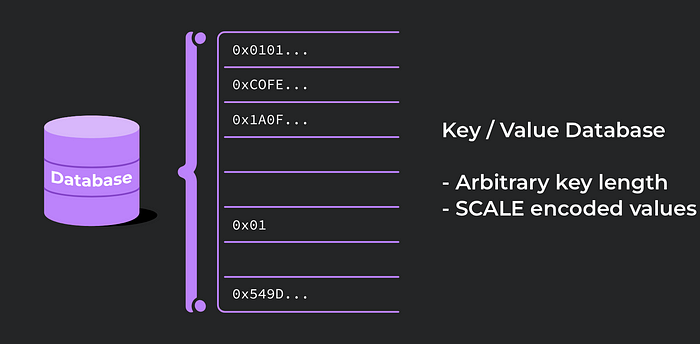

# Discovery & PoC: Understanding ink! Smart Contracts
### A Journey with Protofire

## Introduction

This research article provides an exploration of the Contract Pallet. The motivation behind this comprehensive study stems from our proposal to develop a multi-signature wallet using the Ink! smart contract language.

The proposal identifies a significant gap in the Dotsama ecosystem: the absence of a smart contract multi-signature wallet that allows users interacting with smart contracts securely.

The team at Protofire DAO aims to address this gap by implementing an Ink! smart contract with a user interface focused on the user experience. However, to successfully develop this solution, a deep understanding of the underlying technology — the Contract Pallet — is necessary. This is where the research article comes into play.

The article delves into the intricacies of parachains and smart contracts, the role of the Contract Pallet, the limitations of smart contracts, the use of Ink! as a language to write this contract, and much more. It provides the foundational knowledge required to comprehend the complexities of developing a multi-signature wallet in this ecosystem.

By understanding the detailed workings of the Contract Pallet, developers can better appreciate the challenges and opportunities presented by the proposal.

## Parachains and Smart Contracts: A Comparative Analysis
### Parachains
When it comes to Substrate, Polkadot, or Kusama, a common question is when to develop a parachain versus when to develop a smart contract.

In the context of Dotsama, a parachain leases a slot for a specific period, typically up to two years. The lease grants the parachain a fixed slot to execute its business logic, also known as its state transition function, and store its modified state in a block. In Substrate terminology, this state transition function is referred to as the chain’s runtime.

It’s crucial to understand that a parachain’s state transition function is not further validated; it’s up to the parachain to decide how it utilizes its slot time. The parachain has already prepaid for its slot through the slot auction. This prepayment grants the parachain the freedom to construct
its own blockchain world. For instance, it can decide how transaction fees are charged or even opt not to charge any transaction fees at all. These options are significant when creating new and user-friendly business models. However, the parachain must adhere to certain ground rules. One such rule is the consensus algorithm that governs communication between the Relay Chain and the parachain. These ground rules contribute to the advantages of Polkadot and Kusama, such as shared security, cross-chain communication, and guaranteed execution slot time.

### Smart Contracts
​Polkadot distinguishes itself from other ecosystems by having parachains and smart contracts exist at different layers of the stack, with smart contracts residing on top of parachains.

An existing parachain needs to include the Contract Pallet module to allow users to deploy smart contracts. These contracts are always considered untrusted code. Anyone with tokens of the chain can upload one without requiring permission. Smart contracts enable the permissionless deployment of untrusted programs on a blockchain. The Contract module
assumes that these programs may act adversarially, so it incorporates various safety measures to prevent the contract from stalling the chain or corrupting the state of other contracts. Some of these safety measures in this pallet include gas metering and deposits for storing data on-chain.

## Summary
To summarize this crucial distinction: developing a parachain runtime is different from developing a smart contract, as a smart contract sits on top of a parachain.

The decision between constructing a parachain and developing a smart contract presents a unique set of trade-offs. When you opt for a parachain, you gain the freedom to establish all thegoverning rules of the chain. This freedom, however, comes with the responsibility of managing governance and crypto-economics, among other factors.

On the other hand, the development of a smart contract is a more streamlined process. Developers only require a few tokens to deploy a smart contract. However, this simplicity comes with its own set of constraints. Smart contracts are bound by the rules set by the chain and must adhere to necessary safety measures. Additionally, due to the extra logic involved, a smart contract can never match the speed of a native pallet built directly into the parachain runtime.

## The Role of Contract Pallet
### Main Functionality
The Contract Pallet is responsible for deploying and executing WebAssembly smart contracts within the runtime.

These smart contract accounts have the capability to create instances of smart contracts and make calls to both contract and non-contract accounts.

Smart contract code is stored once in a code cache and can be retrieved using its hash. This means that multiple instances of smart contracts can be created from the same hash without duplicating the code.

When a smart contract is called, its associated code is retrieved using the code hash and executed. This call can modify the storage entries of the smart contract account, create new smart contracts, or invoke other smart contracts.

Regarding the calls done to a smart contract, senders must specify a gas limit for each call, as all instructions invoked by the smart contract require gas. Unused gas is refunded after the call, regardless of the execution outcome.

### Error Handling
Failures in sub-calls do not propagate to the calling contract. When a failure occurs in a sub-call, it does not affect the entire call stack, and the call will only revert at the specific contract level. For instance, if the gas limit is reached, all calls and state changes (including balance transfers)
are reverted only at the current contract level.If contract A calls contract B and B runs out of gas during the call, all of B’s calls are reverted. A can decide how to handle the failure, either by continuing execution or reverting A’s changes.

### The Challenge
When the multisig contract makes a call to another contract and that call fails, it needs to decide how to handle the failure. This decision-making process needs to be designed with care. It’s important to ensure that the multisig contract behaves correctly and predictably in the face of sub-call failures. This might involve implementing robust error handling mechanisms and providing clear feedback to the contract owners about the outcome of calls.

Furthermore, the gas limit for sub-calls needs to be set judiciously to minimize the risk of running out of gas.

### Limitations
It’s important to note that the scope of smart contracts is primarily limited to the Contract Pallet itself, and they generally cannot directly access other pallets within the Substrate framework.

In the Contract Pallet’s default configuration, smart contracts can interact with the runtime through a set of predefined basic smart contract interfaces. This API offers various interactions, including the ability to call and create other smart contracts on the same chain, generate events, access contextual information, and perform cryptographic operations. However, if the default feature set does not meet the requirements of a particular Substrate-based blockchain, the chain extension feature can be used to expand the API and provide access to additional runtime logic.

## ink!: An Embedded Domain-Specific Language
ink! is an embedded domain-specific language designed for the Rust programming language. It enables developers to write smart contracts using the familiar Rust syntax, augmented with additional features tailored for this domain. The Contract module within Substrate is responsible for executing these contracts in a secure manner. In essence, ink! allows you to leverage Rust to write smart contracts for Substrate-based blockchains that incorporate the Contract Pallet module.

In this document, our focus will be solely on providing the relevant information necessary to achieve our goal of building the multisig functionality. Therefore, we will skip the general information about the ink! programming language and instead, we will present the specific and
relevant information gathered from our research that is crucial for achieving our desired objective.

## Storage
In ink!, storage data is always encoded using the SCALE codec. The storage API functions by storing and retrieving entries in/from individual storage cells, each with its own dedicated storage key. This approach is similar to a traditional key-value database.



There are two types of storage layouts: Packed and Non-Packed. Packed types can be stored entirely in a single storage cell. By default, ink! attempts to store all fields of a storage struct in a single cell. With a Packed layout, any contract message interacting with storage will need to operate on the entire storage struct.
For small storage structs with a few fields, retrieving all data from storage in every message is not an issue and may even be advantageous. However, if a contract stores a large vector or structure but provides messages that don’t require accessing it, there will be unnecessary runtime overhead and extra gas costs.

If a Packed layout type becomes too large (such as an ever-growing Vec), it can break the contract because encoding and decoding storage items have a limited buffer capacity (around 16KB in the default configuration). Contracts trying to decode beyond this capacity will encounter an error. To handle potentially large data structures, consider using an ink! Mapping, which can store an arbitrary number of elements.

## The Challenge
In the context of the multisig contract, the storage layout design is a critical aspect that needs careful consideration. It determines how data is stored and retrieved, which directly impacts the contract’s performance and gas costs. We may need to accommodate potentially large datastructures, such as the list of owners and the list of active transactions. If these lists grow too large, they could exceed the buffer capacity for encoding and decoding storage items.

To avoid this, it’s important to define a maximum number of owners and active transactions that can be stored on-chain. These limits need to be chosen carefully to ensure that they are large enough to provide the necessary functionality, but not so large that they risk breaking the contract.

### Selector
Selectors in ink! are a way to identify constructors and messages in a language-agnostic manner. These selectors are four-byte hexadecimal strings, such as “0xad6d4358”.

In ink!, a unique selector is automatically generated for each message and constructor by default. This is a crucial step because when the contract is compiled into a WebAssembly (Wasm) blob, the original method names are no longer retained. Instead, these selectors serve as identifiers for the corresponding methods. When a function needs to be invoked, it’s the
selector that is called upon, effectively mapping to the intended method within the contract’s underlying layers.

To find the selector of a constructor or message in an ink! contract, you can refer to the “selector” field in the contract’s metadata for the specific dispatchable you are interested in.

If the contract’s metadata is not accessible, you can calculate the selector yourself using a straightforward algorithm

1. Take the name of the constructor or message.
2. Compute the BLAKE2 hash of the name.
3. Extract the first four bytes of the hash as the selector.

Ink! also allows using custom selectors, and while they offer the advantage of allowing function name changes while preserving the selector, they also pose certain risks. Unlike Solidity, ink! does not require matching function signatures with selectors, making it easier for scammers to exploit this vulnerability. Furthermore, custom selectors can cause confusion for third-party monitoring and indexing services that rely on standard selectors, potentially leading to errors in transaction monitoring.

### Auto-generated selector example:

```RUST
#[ink(message)]
pub fn add_owner(&mut self, owner: AccountId) -> Result<(), Error> {
  ...
}
```
1. add_owner
2. blake_2(“add_owner”)
0xad6d4358e5e509481528506e3b61c84ed6c56230ec3a2a1a0f48359c6641af30
3. fn selector: 0xad6d4358

### Custom Selector Example:

```RUST
#[ink(message, selector = 0xAAAAAAAA)]
pub fn add_owner(&mut self, owner: AccountId) -> Result<(), Error> {
  ...
}
```
Considering that the selector is set in an arbitrary manner,, its value is not computed based on the function name.
- fn selector: 0xaaaaaaaa

## The Challenge
Unlike typical contracts that interact with a predefined set of other contracts, the multisig contract is designed to interact with any on-chain contract. This necessitates a more low-level approach, where instead of calling a function by name, the function is invoked using its method selector.

When a transaction is proposed to the multisig contract, the method selector must be provided along with other required parameters. However, obtaining this selector is not straightforward. It is part of the contract’s metadata, which needs to be obtained and trusted.

The challenge lies in securely obtaining and verifying this metadata. It could be provided by one of the owners or retrieved from a trusted server, but either way, it needs to be trusted. If the metadata is incorrect or tampered with, it could lead to incorrect function calls, potentially causing erroneous approvals or rejections.

## Contract Metadata
Ink! metadata serves as a language-agnostic descriptor for a contract. It is primarily intended for use by third-party tools such as user interfaces and block explorers, enabling them to correctly call contract functions and interpret events. The metadata is generated when a contract is built using the cargo contract build command and can be found in the contract’s target directory under the name ```<contract-name\>.json```.

The metadata is defined by several required keys: source, contract, and abi (Application Binary Interface). It may also contain optional user-defined metadata.

The abi of a smart contract is a crucial piece of information that describes how to interact with the contract. It includes details about the contract’s functions, their inputs and outputs, events, and more. In essence, the abi serves as a blueprint for interacting with a contract.

- The source key provides information about the contract’s Wasm code, including the hash, language, and compiler used.
- The contract key offers additional metadata about the contract, such as its name, version, and authors.
- The abi key contains the raw JSON of the contract’s abi metadata, generated during contract compilation.

## The Challenge
In the context of a multisig contract, the abi becomes even more important. Owners of the multisig contract need to be able to decode transactions and understand what they’re approving or rejecting. Without the abi, the raw transaction data is just a string of bytes that’s difficult to
interpret.

### Non-determinism in ink! contract builds
The build process of ink! contracts is subject to non-determinism due to several factors. These factors encompass the version of Rust, enabled features, cargo-contract version, number of optimization passes, and build mode. As a result, the final product of the contract build can vary.

The non-deterministic nature of the build process poses challenges for contract verification. Establishing trust in a contract’s reliability becomes difficult when the build outcome is not consistent across different operating systems and architectures. **Trust is crucial for users who rely on the contract’s functionality and need assurance of its integrity.**

The presence of non-determinism in ink! contract builds needs careful consideration during the verification process. Extra precautions and thorough testing may be required to ensure that the contract behaves as intended across different build environments. By addressing the challenges posed by non-determinism, it becomes possible to enhance trust in ink! contracts and promote their reliability for users.

## The Challenge
The inherent non-determinism in the build process of ink! contracts presents a significant hurdle for owners of a multisig contract intending to interact with an arbitrary contract. Despite having the same source code, each owner could independently compile the contract and end up with a distinct wasm and code hash. This discrepancy makes it impossible for any owner to conclusively demonstrate that they’ve generated an identical contract from the same source code. They might end up with slightly different ABIs, leading to inconsistencies when decoding transactions. Consequently, this could lead to confusion regarding the purpose of a transaction, potentially causing erroneous approvals or rejections.

To address this issue, it’s important to have a secure way to exchange the ABI among the owners. This could be done through a secure communication channel, or by hosting the ABI on a trusted server. The key is to ensure that all owners are using the exact same ABI to decode transactions.

However, it’s important to note that both of these solutions inherently involve a degree of trust. If the ABI is exchanged directly among the owners, each owner must trust that the others are providing the correct and unaltered ABI. Similarly, if the ABI is hosted on a trusted server, all owners must trust that the server is secure, reliable, and providing the correct ABI.

## Cross-Contract Calls
Cross-contract calls in ink! contracts enable the invocation of messages and constructors of other contracts on the same chain. To facilitate such calls, ink! provides the CreateBuilder and CallBuilder interfaces. The CreateBuilder is used to instantiate already uploaded contracts, while the CallBuilder allows for calling messages on instantiated contracts.

To instantiate a contract using the CreateBuilder, a reference to the contract and relevant parameters are required. For the instantiation process, the code hash, gas limit, transferred value, constructor arguments and salt bytes are needed.

Once a contract is instantiated, the CallBuilder provides the means to make calls to other contracts. It supports regular Calls, where an already instantiated contract is specified. For the invocation of a call, the contract address, gas limit, transferred value, selector, message arguments and some optional flags are needed.

In the context of the multisig contract, only the CallBuilder interface will be utilized. This is because the multisig contract is designed to interact with any arbitrary smart contract already deployed on the blockchain, rather than instantiating new contracts. By using the CallBuilder, the multisig contract can make calls to any other contract on the same chain.

Example:
In the following example, we initially assume that the contract we’re interacting with uses the default selector for each function:

```RUST 
let result = build_call::<DefaultEnvironment>()
  .call(AccountId::from([0x42; 32]))
  .gas_limit(0)
  .transferred_value(0)
  .exec_input(
    ExecutionInput::new(Selector::new(ink::selector_bytes!("add_owner")))
      .push_arg(&[0x10u8; 32])
  )
  .returns::<Vec<u8>>()
  .invoke();
```

However, in practice, we cannot make this assumption. Instead, we need to use the provided selector directly:


```RUST 
let result = build_call::<DefaultEnvironment>()
  .call(AccountId::from([0x42; 32]))
  .gas_limit(0)
  .transferred_value(0)
  .exec_input(
    ExecutionInput::new([170,170,170,170].into())
      .push_arg(&[0x10u8; 32])
   )
  .returns::<Vec<u8>>()
  .invoke();
```

Furthermore, we won’t know in advance how many arguments the function will have. Therefore, we can only push arguments once as an opaque Vec of u8s. The arguments will need to be transformed on the frontend from their arbitrary types to a concatenated vec of u8s:


```RUST 
struct InputArgs<'a>(&'a [u8]);

impl<'a> scale::Encode for InputArgs<'a> {
  fn encode_to<T: Output + ?Sized>(&self, dest: &mut T) {
    dest.write(self.0);
  }
}

let result = build_call::<DefaultEnvironment>()
  .call(AccountId::from([0x42; 32]))
  .gas_limit(0)
  .transferred_value(0)
  .exec_input(
    ExecutionInput::new([170,170,170,170].into())
      .push_arg(InputArgs(&[1,2,3,4]))
  )
  .returns::<Vec<u8>>()
  .invoke();
```

It is important to note that message arguments should match the order and type specified in the function signature. Compile-time feedback is not available for call failures, and errors can only be detected at runtime.

Both the CreateBuilder and CallBuilder offer error handling through the try_instantiate() and try_invoke() methods, respectively. These methods allow developers to handle errors from the execution environment and the programming language itself.

By utilizing these builders, ink! contracts can effectively interact with other contracts on the chain, facilitating the exchange of messages and constructor invocations.

## The Challenge
The challenge lies in generating the raw bytes needed as arguments for the transaction that is intended to be submitted. Given that we won’t know in advance how many arguments the function will have, the frontend will need to transform these arguments from their arbitrary types into a concatenated vector of u8s. This process involves encoding the arguments in a way that matches the order and type specified in the function signature.

## Conclusion
This comprehensive research article has delved into the intricacies of the Contract Pallet. The motivation behind this study was to gather the necessary information to develop a multi-signature wallet using the ink! smart contract language.

The article has explored the differences between parachains and smart contracts, the role of the Contract Pallet, and the limitations of smart contracts. It has also examined the use of Ink! as a language to write smart contracts, the challenges of storage layout design, the importance of selectors, the role of contract metadata, and the implications of non-determinism in Ink! contract builds.

The research has highlighted several challenges that need to be addressed. These include handling sub-call failures, securely obtaining and verifying contract metadata, dealing with non-determinism in contract builds, and generating the raw bytes needed as arguments for transactions.

In conclusion, the research has provided a solid foundation for the development of the multi-sig and has contributed to the broader understanding of smart contracts in the Substrate ecosystem. It has also highlighted the need for further research and development to address the challenges identified.