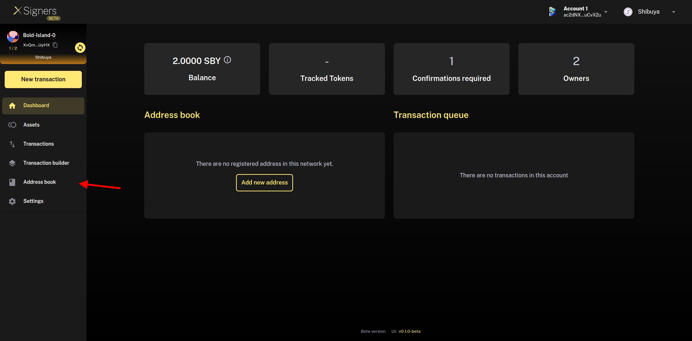
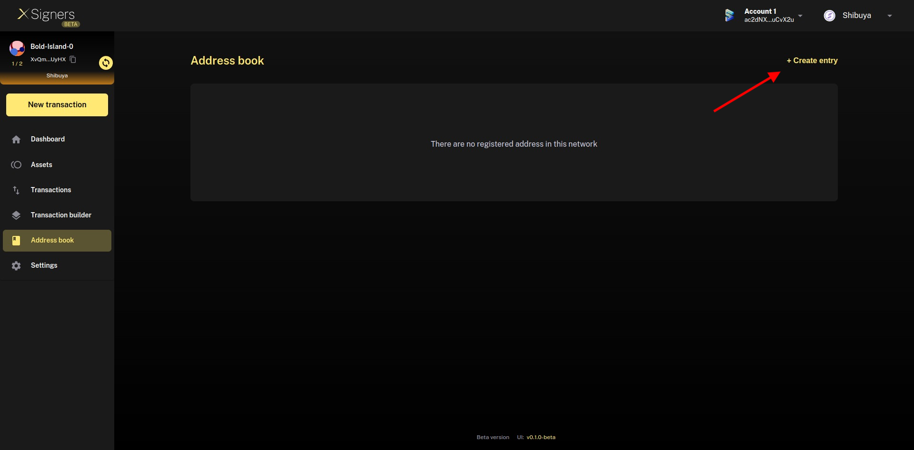
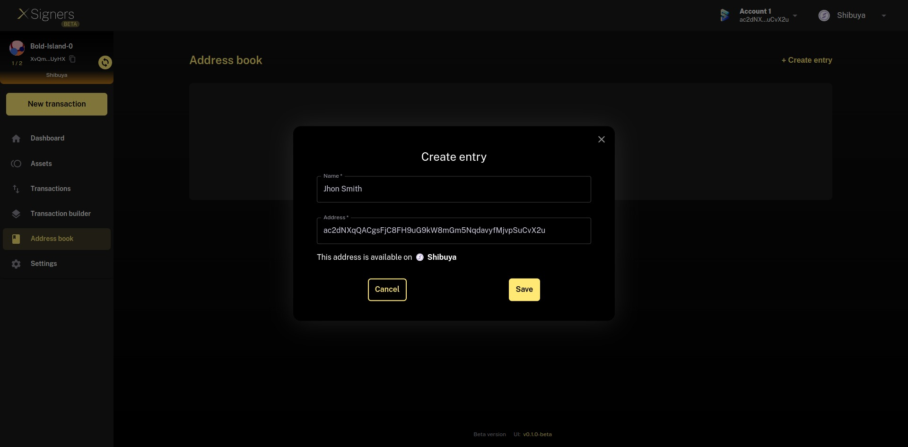
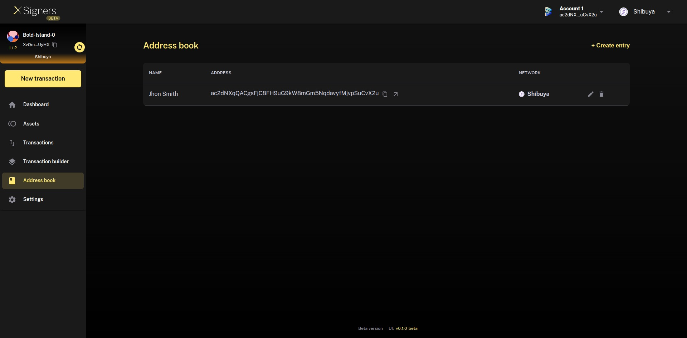

# Address book

The address book allows you to easily manage your signatories. 
You can manage your address book in the **Address Book** page: add and remove addresses with ease in your account. Users can add and edit the name of wallets in their address book enabling better account management.
**Clarification: when you add, edit or remove an address of one multisig account, it will be updated in all the account that you are connected on the browser that you are using**

## Create new entry: 
To create a new entry, click on **Create entry**. You then just need to define the address you want to add and give it a name.

## Edit entry
To modify an address book entry, click on the pencil icon.
The row will change to be editable and you will be able to change the entry and save the changes.

## Remove entry
To delete an entry, click on the trash icon.

