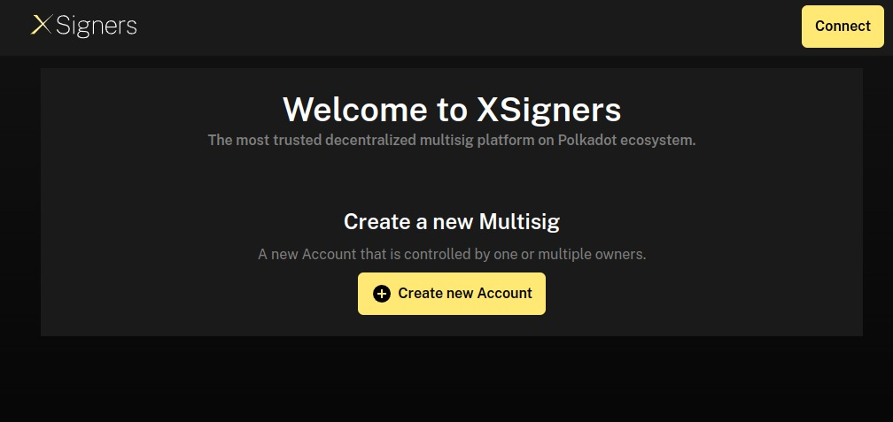
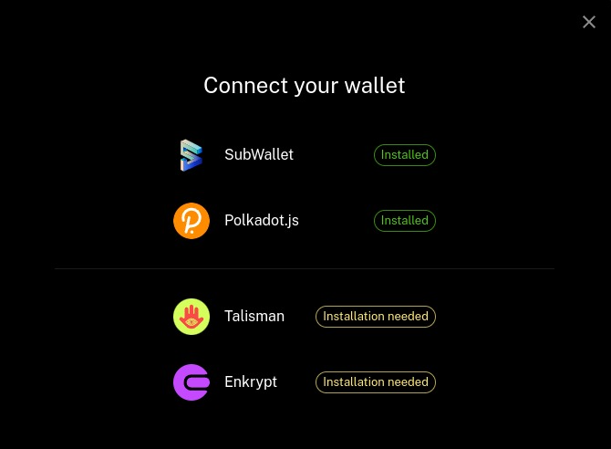
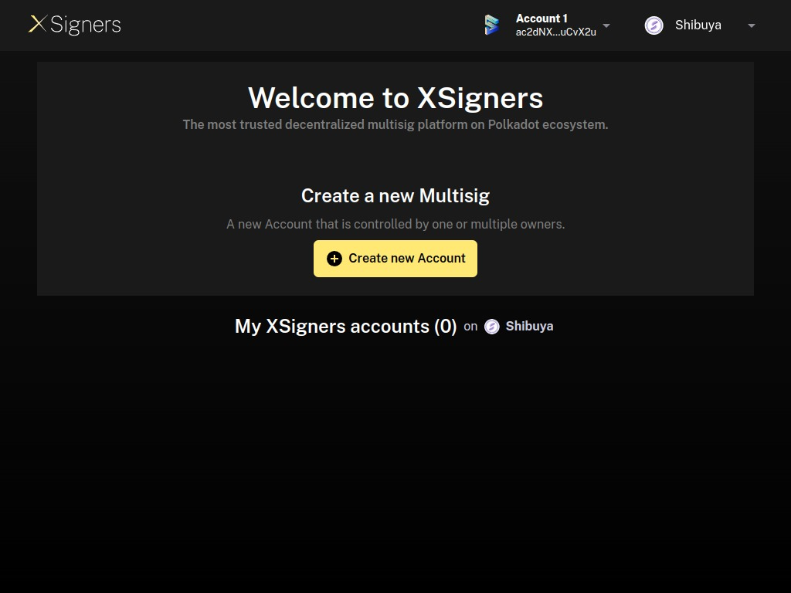
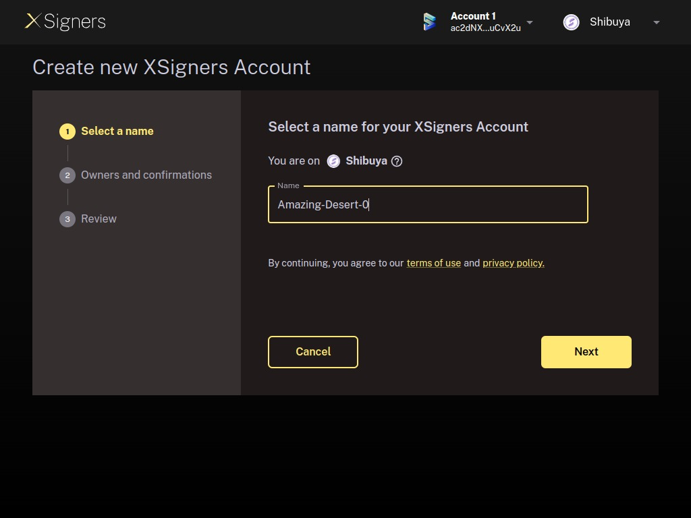
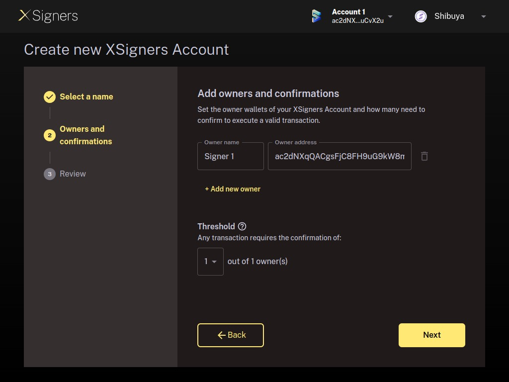
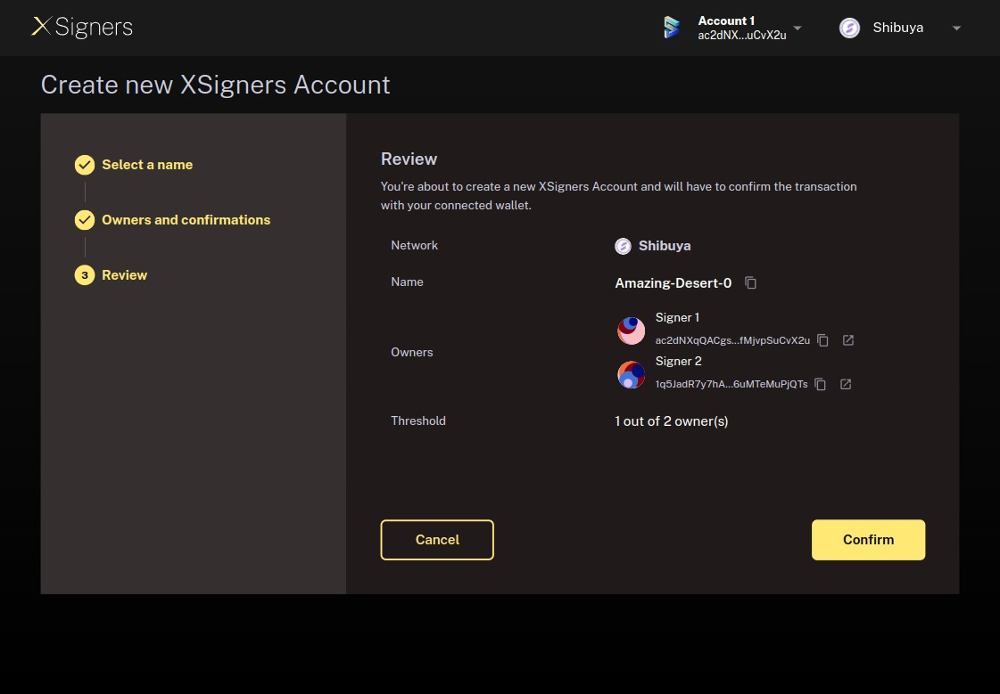
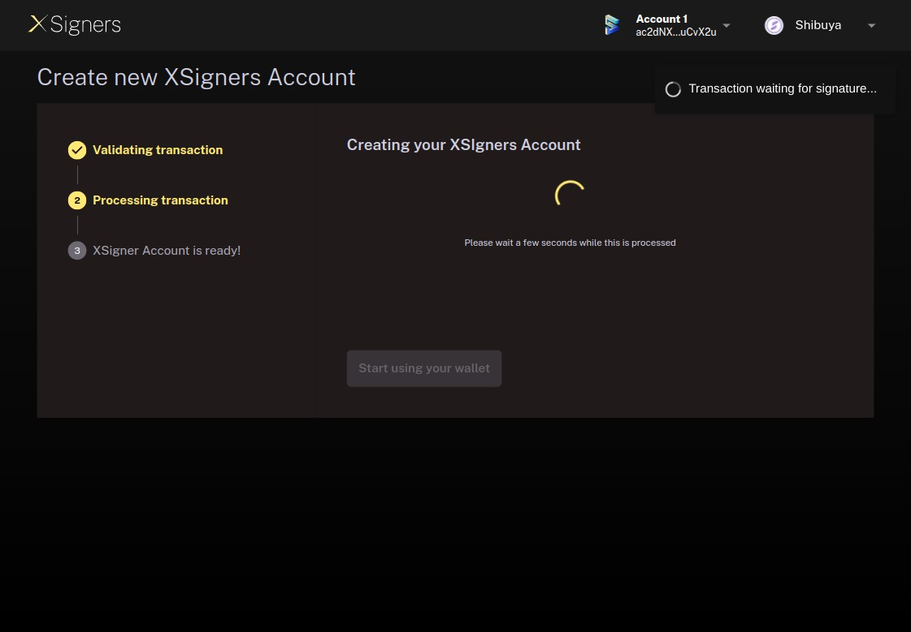
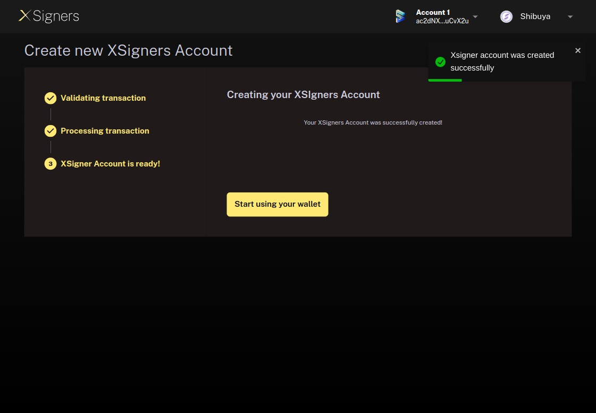
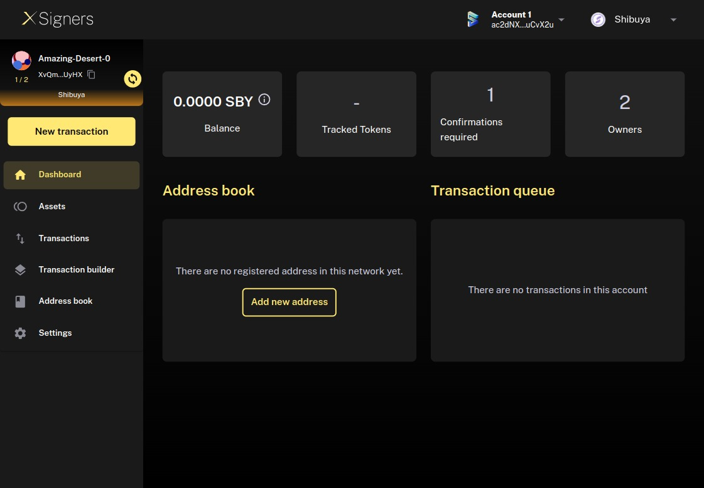

# Create a multisignature account

### Creating an Ink! multisig account will take just a few minutes. Here is a walkthrough to get started:

First of all, you will need to have one of the following extensions installed and have a wallet created:

- Subwallet
- Polkadot.js
- Talisman
- Enkrypt

You are going to see the text **‘installed’** next to the extension if it is installed in the browser. Opposite case, you will see the text **‘installation needed’**

## Step 1
First, open the web app at [https://xsigners.io](https://xsigners.io) We recommend using Google Chrome. 

## Step 2
**Connect your wallet:** press on the **Connect** button at the top of the page and select the extension and wallet to be used.
Once a wallet is selected, you can start the process of setting up your account on the Shibuya network by clicking on "Create New account". 
Clarification: If your wallet is the owner of one or many accounts, you will see the list of these accounts at the end of the welcome page.

## Step 3
**Select a name:** first, you'll need to give a name to your new Ink! Multisig account. This name is only stored locally on your computer and never shared with any third party.

## Step 4
**Owners and confirmations:** in this step you are going to define the addresses that have permission to submit and approve transactions (you can update these addresses from the *Settings* menu).

Your connected signer wallet is already added as a suggestion for the first signer, and you **can not** change it. Add as many signers as you want setting a Shibuya address.

**Define confirmation threshold:** the last step is selecting how many signer confirmations a transaction or any settings change of your account requires before it is approved and executed. Please, determine your setup carefully. If you do not have access to enough signers to reach the threshold, you will not be able to recover your assets.

## Step 5
**Review and deploy Ink! Multisig account:** after you have reviewed all parameters, you can submit the creation of your account pressing on the *Confirm* button

## Step 6
To finalize the account creation, you will need to sign the transaction for which it will be mandatory to have some balance on the Shibuya network.

## Step 7
Once the account is ready, a button to start to use it will be enabled and after pressing on it, the account will be opened.

