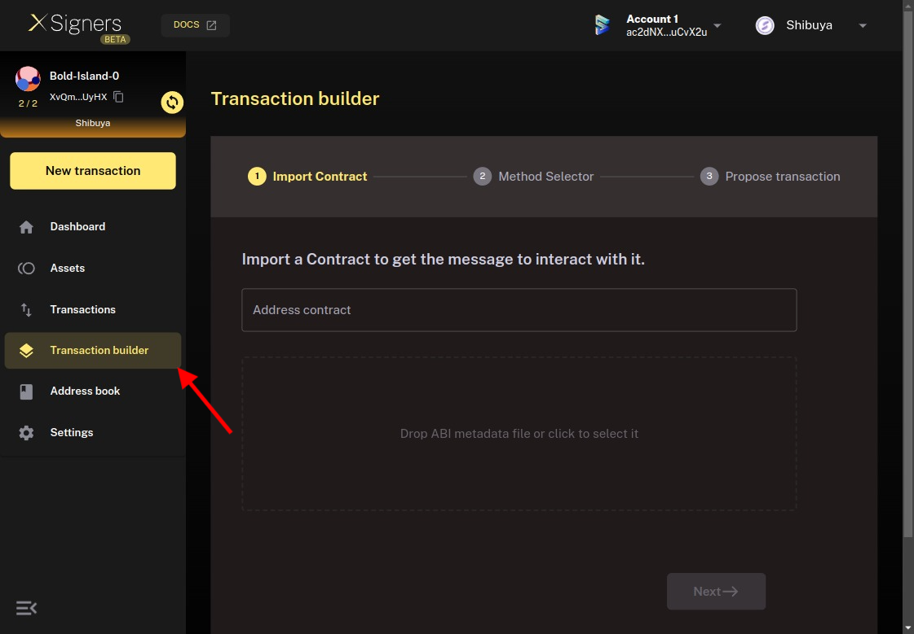
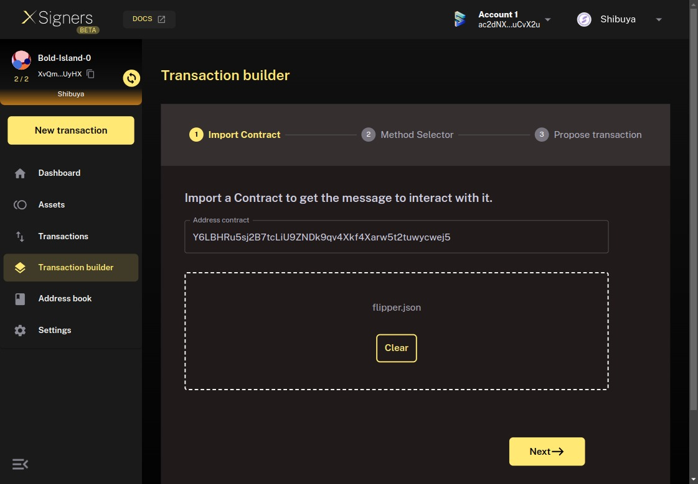
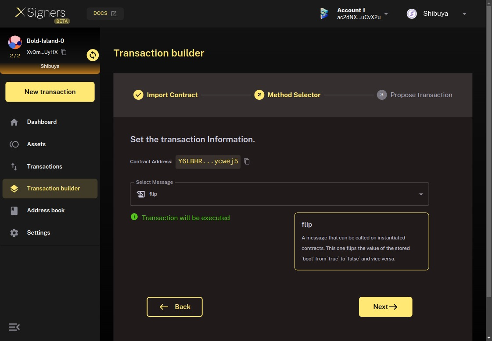
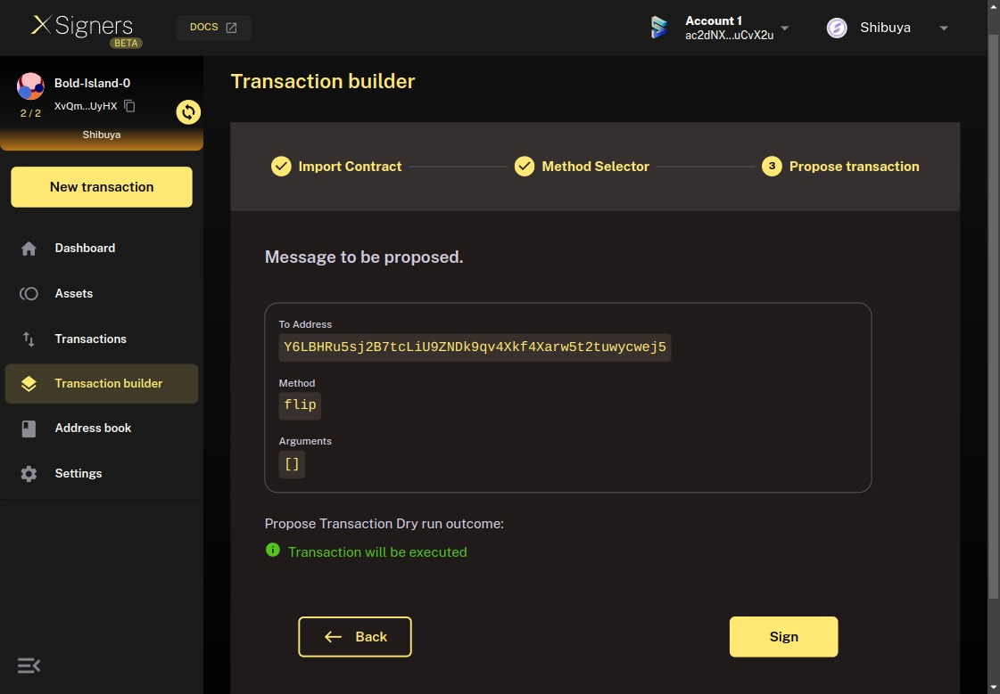
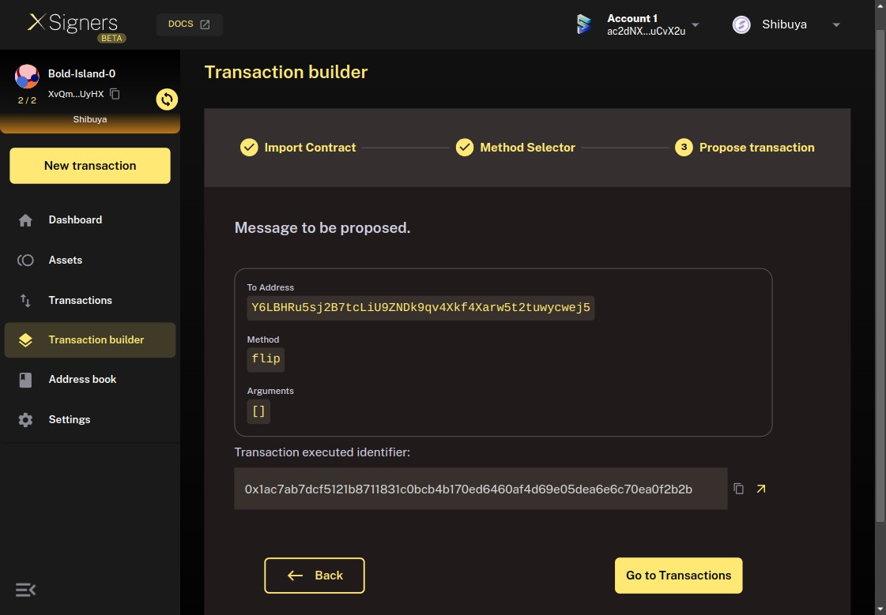

# How to use the transaction builder
How to directly interact with smart contracts from your multisig account. You can access the **Transaction builder** feature using the Transaction builder menu at the left bar and the process consists of three sections: **Import contract, Method selector and Propose transaction**.

# Import Contract
## Step 1
Set a smart contract to interact with: first, you need to paste a valid Shibuya address of a smart contract that you would like to interact with.

## Step 2
Specify the ABI: you have to upload the ABI metadata file by dropping or selecting it in the files explorer.

# Method Selector
## Step 3
Select the method: You can now select one of the available methods for this contract. We only support write functions.

## Step 4
Define parameter if needed: The interface will now display the parameters and parameter types of this method. You will need to complete them to continue with the following step.

# Propose transaction
## Step 5
You can review your smart contract interaction and sign the transaction. 

## Step 6
After signing the transaction, you will see the transaction hash and have the possibility to go to the transactions page. Depending on your owner setup, the transaction will have to be confirmed by other owners as well.

